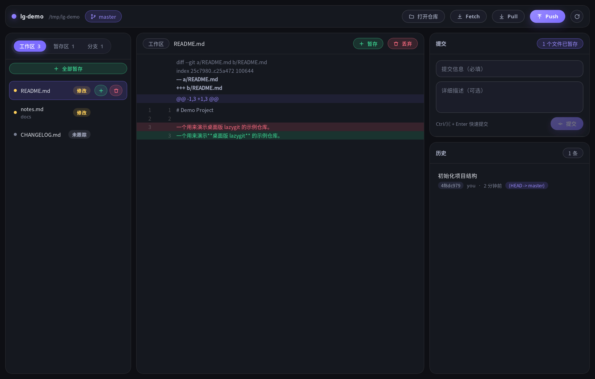

# Bingit

**冰冰的 git 客户端** —— 复用 lazygit 的核心逻辑、重写图形界面的桌面版 Git 工具。

> 名字来自 **冰（bīng）+ git**。图标是冰晶与 git 分支的融合：
> 主干加两条对称侧枝构成 git 图，枝杈末端带冰晶碎片。

<br clear="left">



一句话概括：**git 逻辑继续用 lazygit 的，界面换成带圆角边框和胶囊按钮的桌面 App。**

- 用 [Wails](https://wails.io) 打包，前端是 React + TypeScript，后端是 Go。
- 复用 lazygit 的 `pkg/commands`（git 命令封装、模型、patch 解析、配置、i18n），
  **完全没有引入它的 `pkg/gui` 和 `pkg/gocui`** —— 原来那套 TUI 视图 / 上下文 /
  控制器一层都不用。
- 界面上的每一个动作都是「UI 发意图 → 引擎执行 git → 返回新快照 → UI 重绘」。
  前端不推算 git 状态，永远只渲染引擎给的快照，所以 UI 可以随意重写。

---

## 目录

- [功能](#一功能)
- [架构](#二架构)
- [从源码构建](#三从源码构建)
- [使用](#四使用)
- [键盘快捷键](#五键盘快捷键)
- [Git 全命令操作面板](#六git-全命令操作面板)
- [几个设计决定](#七几个设计决定)
- [测试](#八测试)
- [打包成 deb（UOS / Deepin）](#九打包成-debuos--deepin)
- [已知限制](#十已知限制)
- [许可](#十一许可)

---

## 一、功能

### 仓库

- 启动页三个入口：**新建仓库**（`git init`）、**打开本地仓库**、**从网址下载仓库**（`git clone`，支持浅克隆，带实时进度条）
- 把文件夹（或仓库里的任意文件/子目录）**拖进窗口**即可打开它所属的仓库
- 打开一个还不是仓库的目录时，会问你要不要就地初始化，而不是干巴巴地报错
- **自动刷新**：在编辑器里改完文件、在终端里跑完 git 命令，切回窗口时列表已经是新的（基于 fsnotify 监听仓库）

### 变更

- 文件列表按「变更 / 暂存」分组，带状态徽标和 `+N -M` 行数统计
- 暂存 / 取消暂存单个文件、全部暂存、全部取消暂存
- **文件树视图**：单子目录链自动合并（`src/components/Foo.tsx` 不会变成三层缩进），可切回平铺
- **行级暂存**：在 diff 里勾选具体的行或整个 hunk，只把选中的部分放进暂存区
- **丢弃改动**：已跟踪走 `git checkout --`，未跟踪直接删文件
- **回收站**：丢弃之前会把文件内容存成一个 git 对象，之后可以恢复回来
  （这是全软件里唯一会真的让内容消失的操作，所以单独给了兜底）

### 提交

- 标题 + 描述，`Ctrl/⌘ + Enter` 提交
- **修补上一次提交**：把当前暂存的改动合进上一条，不用新增提交
- **未配置 `user.name` / `user.email` 时**，提交面板会直接变成身份配置表单
  （否则 git 只会丢一句英文 `fatal: unable to auto-detect email address`）
- **撤销上一步**：基于 reflog 的 `git reset --soft HEAD@{1}`，只移动分支指针，
  工作区内容一点都不动，改动会回到暂存区
- **冲突中有出路**：处于变基 / 合并 / 拣选 / revert 中断状态时，顶栏会直接给出
  「继续」和「中止」两个按钮

### 历史

- 提交列表带**泳道图**（SVG 绘制，含合并连线）
- 点开某个提交 → 左边是这次改动涉及的文件，右边是选中文件的 diff
- 提交列表可搜索（提交信息 / 作者 / 提交号 / 标签）
- 右键任意提交，直接做这些事（不用记命令）：
  拣选到当前分支、生成反向提交、以此为起点新建分支、打标签、
  回退到这里（保留改动 / 保留在工作区 / 丢弃所有改动）、复制提交号

### 分支 / 标签 / 远端

- **分支**：切换、新建（可指定起点）、重命名、删除、合并到当前分支、把当前分支变基到它；
  右键菜单里还有复制分支名
- **远端分支**：单独一节列出（含 `origin/HEAD` 之外的追踪分支），能直接检出为本地分支
- **标签**：列表（区分附注标签和轻量标签）、新建、删除、推送单个或全部
- **远端**：添加、改地址、删除，地址里的凭据会自动剥离后再显示到界面上
- **储藏**：列表、保存（可选是否包含未跟踪文件）、应用、弹出、删除、预览内容

### 同步

- Fetch / Pull / Push，带实时进度（阶段名和百分比是从 git 的 stderr 解析出来的）
- 网络操作期间**不持有引擎锁**，所以推送大仓库时你照样能看历史、看 diff
- **上传到 GitHub / Gitee**：调平台 API 创建远端仓库 → 添加 origin → 推送并设置上游
- 上传失败会**自动重试**瞬时故障（连接被重置、TLS 握手中途被掐、5xx），
  最多 3 次并逐步退避；确定性失败（仓库重名、token 没权限、non-fast-forward）
  不重试，直接报错

### 其它

- **仓库文件浏览**：文件树 + 只读内容查看
- **Git 操作面板**：110 个 git 操作的图形表单 + 任意原始命令入口（见下）
- 操作音效（Web Audio 实时合成，不含任何音频文件，可一键静音）
- 全部危险操作都有确认框，并显示**即将执行的 git 命令**

---

## 二、架构

```
┌──────────────────────────────────────────────────────┐
│  UI 层   React + TypeScript                          │
│    TopBar / Sidebar / DiffPanel / CommitPanel /       │
│    HistoryPanel / Operations / PublishDialog          │
└───────────────────────┬──────────────────────────────┘
        意图(intent) ↓        ↑ 快照(snapshot)
                 Wails 自动生成的绑定
┌───────────────────────┴──────────────────────────────┐
│  App 层  (app.go)  很薄，只做转发 + 调系统目录选择框    │
└───────────────────────┬──────────────────────────────┘
┌───────────────────────┴──────────────────────────────┐
│  Engine 层  (engine/)  无界面，可独立测试               │
│    · 状态快照  · 动作执行  · diff 提取  · 文件监听        │
└───────────────────────┬──────────────────────────────┘
│  lazygit 核心（直接 import，未改动一行）                │
│    pkg/commands            git 命令封装                │
│    pkg/commands/models     commit/branch/file 模型     │
│    pkg/commands/patch      patch 解析                  │
│    pkg/config              用户配置                     │
│    pkg/i18n                文案                        │
└──────────────────────────────────────────────────────┘
```

要点：

- **前端不持有 git 逻辑**。每个动作都返回一份完整快照（`RepoSnapshot`），
  界面只渲染快照。所以换 UI 技术栈不需要动引擎。
- **引擎可以独立测试**：`engine/` 不依赖任何界面代码，`go test ./engine/...` 直接跑。
- **加一个 git 命令 = 加一条数据**。`engine/catalog.go` 里描述命令、参数、
  是否危险，前端自动渲染出对应表单，不用写任何 UI 代码。
- 引擎会读取你已有的 lazygit 配置（`~/.config/lazygit/config.yml`），
  所以 `git.mainBranches`、日志排序、diff renderer 这些设置都会生效。

### 目录结构

```
lazygit-desktop/
├── main.go                   Wails 入口（窗口配置、嵌入前端产物）
├── app.go                    绑定给前端的薄转发层
├── engine/                   无界面引擎，可独立测试
├── cmd/dump/                 引擎自检工具：把读到的快照打成 JSON
├── frontend/                 React + TypeScript 界面
│   ├── src/api.ts            前端唯一通道 + 浏览器 mock 回退
│   ├── src/mock.ts           演示数据（不编译 Go 也能预览界面）
│   └── src/components/       面板组件
├── packaging/build-deb.sh    按 UOS 规范打包 deb
├── assets/                   应用图标
└── go.mod                    ← replace 指向本地 lazygit 源码
```

---

## 三、从源码构建

### 依赖

| 组件 | 要求 |
|---|---|
| Go | 1.25 或更高 |
| Wails CLI | v2.15 或更高（`go install github.com/wailsapp/wails/v2/cmd/wails@latest`） |
| Node.js / npm | 用于构建前端 |
| 系统库 | Linux 需要 `libwebkit2gtk-4.1-dev` 和 `libgtk-3-dev` |

Linux 上的系统库（Debian / Ubuntu / UOS）：

```bash
sudo apt install libwebkit2gtk-4.1-dev libgtk-3-dev
```

### 关键一步：准备 lazygit 源码

本项目通过 `go.mod` 的 `replace` 直接引用 **lazygit 的源码**（不是发布版模块），
所以你需要自己准备一份：

```bash
git clone --depth 1 https://github.com/jesseduffield/lazygit.git
```

> ⚠️ **这一步不做的话编译必然失败。** 仓库里提交的那一行 `replace` 是开发机上的
> 绝对路径，换一台机器就不存在了。clone 之后第一件事就是把
> `lazygit-desktop/go.mod` 最后一行改成你自己放 lazygit 源码的位置：

```
replace github.com/jesseduffield/lazygit => /你的/路径/lazygit
```

> 另一个常见的坑：从 GitHub Releases 下载源码**压缩包**时，解压出来是**嵌套的同名目录**，
> 真正含 `go.mod` 的是里层那个，`replace` 要指向里层。

### 构建

```bash
cd lazygit-desktop
wails build
```

产物在 `build/bin/bingit`。

> **webkit2gtk 版本**：`wails.json` 里带着 `"build:tags": "webkit2_41"`。
> 如果你的系统装的是 webkit2gtk **4.0** 而不是 4.1，把这个标签去掉，否则编译会失败。

### 开发

```bash
wails dev        # 热更新，改前端不用重编 Go
```

只想调界面、不想装 Go？界面和引擎是解耦的，`frontend/src/api.ts` 在检测不到
Wails 环境时会自动回退到 `mock.ts` 的演示数据：

```bash
cd frontend
npm install
npm run dev      # 浏览器打开 http://localhost:5173
```

此时能看到完整界面（除了 Git 操作面板 —— 它的数据来自引擎），
并可交互地暂存 / 提交，顶栏会提示当前是演示模式。

### 引擎自检

界面显示不对时，先用它判断是「引擎没读到数据」还是「界面没画出来」：

```bash
go run ./cmd/dump /path/to/repo     # 打印引擎读到的 JSON 快照
```

---

## 四、使用

```bash
bingit
```

启动后**一律停在启动页**，由你选择：新建仓库、打开本地仓库、从网址克隆，
或者把文件夹直接拖进窗口。

> 早先的版本会自动打开**当前所在目录**对应的仓库，好处是
> `cd 我的项目 && bingit` 能一步到位；但代价是每次启动都会直接进上次所在的那个项目，
> 想开别的仓库得先退出来。现在改成显式选择 —— 想开哪个就开哪个。

打开仓库后，拖进窗口依然生效 —— 拖仓库里的任意子目录或文件都能正确打开整个仓库。

---

## 五、键盘快捷键

| 快捷键 | 作用 |
|---|---|
| `Ctrl/⌘ + K` | 命令面板（搜索全部动作，包括所有分支和最近提交） |
| `Ctrl/⌘ + Z` | 撤销上一步 |
| `Ctrl/⌘ + R` | 刷新 |
| `Ctrl/⌘ + Enter` | 提交 |
| `空格` | 暂存 / 取消暂存当前选中的文件 |
| `↑` `↓` | 在文件列表里移动选中项 |
| `Esc` | 取消选中 / 关闭当前浮层 |

右键菜单也铺得比较满：文件、分支、远端分支、提交都有各自的上下文操作。

---

## 六、Git 全命令操作面板

git 有 159 个顶级命令，给每个命令手写一套界面是不现实的，所以这里用的是
「**命令目录 + 通用执行器**」的数据驱动方案。点顶栏的 **「Git 操作」** 按钮打开：

```
┌─ Git 操作 ────────────────────────────────────────┐
│ 搜索: 合并____________                             │
│ ┌─分类─┐ ┌─操作────────┐ ┌─详情─────────────────┐│
│ │全部  │ │合并分支       │ │合并分支               ││
│ │提交  │ │中止合并       │ │把指定分支合并进当前分支││
│ │分支  │ │变基到分支     │ │[参数表单]             ││
│ │远端  │ │…              │ │[执行]                 ││
│ └──────┘ └───────────────┘ └──────────────────────┘│
└────────────────────────────────────────────────────┘
```

### 收录范围：110 个操作，14 个类别

| 类别 | 数量 | 类别 | 数量 |
|---|---|---|---|
| 提交 | 7 | 撤销 | 7 |
| 分支 | 12 | 工作区 | 4 |
| 远端 | 12 | 子模块 | 6 |
| 标签 | 5 | 补丁 | 5 |
| 储藏 | 8 | 查询 | 10 |
| 配置 | 6 | 维护 | 8 |
| 导出 | 4 | 高级 | 16 |

涵盖：提交/修补/回退/拣选、分支增删改合变基、远端增删改与推送拉取、标签、储藏、
reflog 恢复、worktree、submodule、补丁、日志/blame/grep、仓库维护 gc/fsck、
config、archive/bundle、notes/bisect/sparse-checkout/subtree 等。

### 没收录的命令：原始命令入口

搜索框里始终有一项 **「执行任意 git 命令」**，可以直接执行任何 git 子命令
（包括底层 plumbing 命令），支持引号：

```
cat-file -p HEAD:README.md
rev-list --count HEAD
ls-tree -r HEAD --name-only
```

所以 **159 个命令全都能用**：常用的有专门表单，冷门的走这个入口。

### 设计要点

1. **加一个新命令 = 加一条数据**。`engine/catalog.go` 里描述命令、参数、是否危险；
   前端自动渲染表单，不用写任何 UI 代码。
2. **危险操作有标记**。硬重置、强制推送、清理未跟踪文件这类不可逆操作会标红，
   并在执行前弹出确认框（同时显示即将执行的命令）。
3. **参数用 argv 数组传递，不经过 shell**，所以参数里的特殊字符不会被解释，
   没有命令注入风险。
4. **执行结果原样展示**：界面上会显示实际执行的 `git ...` 命令和完整输出，
   方便学习 git，也方便复制到终端。
5. **命令目录有测试保护**：`engine/catalog_test.go` 会把目录里每个命令名和
   `git --list-cmds` 比对，写错命令名会直接测试失败。

---

## 七、几个设计决定

**网络操作期间不持锁。** 早期的写法是把引擎锁从头拿到尾，于是推送那几秒钟里
界面所有请求都被阻塞，整个 App 看起来像死机。现在只在校验参数和最后刷新快照时加锁，
中间的网络传输是无锁的。

**git 不会卡在凭据提示上。** 桌面应用没有终端，所以所有 git 子进程都设了
`GIT_TERMINAL_PROMPT=0`，宁可失败也不挂着等你输入密码。

**自动刷新用 debounce 合并。** 一次 git 操作会连写好几个文件（index、index.lock、
refs、logs），不合并的话界面会被连续刷新十几次。监听点选在 `.git` 的关键位置
和工作区，跳过 `node_modules` 这类目录（全加进去会吃光 inotify 配额）。

**回收站用 git 对象做备份。** `git hash-object -w` 会把内容写进对象库并返回 SHA，
但它**完全不碰仓库状态** —— 不建引用、不动 index。之后 `git cat-file blob <SHA>`
写回原路径即可。副作用只是对象库里多一个不可达对象，会被 gc 按正常规则回收。

**上传重试区分「瞬时」和「确定性」。** 瞬时失败（连接重置、TLS 握手中途被掐、5xx）
自动重试；确定性失败（non-fast-forward、认证失败、仓库重名）立刻结束，
并且**不编造网络原因** —— 那些场景下 git 的原文比任何猜测都有用。

---

## 八、测试

```bash
cd lazygit-desktop
go test ./engine/...      # 50 个测试
go vet ./...
```

引擎层的测试都是真的在临时目录里建仓库、跑真实的 git 命令，覆盖：暂存与行级暂存、
提交与修补、分支增删改、合并/变基/拣选/revert/reset、冲突状态与中止、
撤销、丢弃与回收站恢复、标签/远端/远端分支读取、上传重试与失败分类、
文件监听，以及若干回归场景（注释里标了「曾经的 bug」的那些）。

前端类型检查与构建：

```bash
cd frontend
npm run build             # tsc --noEmit && vite build
```

---

## 九、打包成 deb（UOS / Deepin）

```bash
cd lazygit-desktop
sudo bash packaging/build-deb.sh
sudo dpkg -i build/deb/org.bingit.app_<版本>_amd64.deb
```

脚本按《UOS 应用打包规范》组织目录：appid 用倒置域名、所有文件装在
`/opt/apps/<appid>/` 下、根目录含 `entries/` `files/` `info`、应用数据只写
`$XDG_*_HOME/<appid>`、用 `dpkg-deb --build --root-owner-group` 且不使用 deb 钩子。

---

## 十、已知限制

1. **没有冲突解决界面**。引擎层已经实现了按块解析冲突文件、逐块选择保留哪一边
   （`engine/conflicts.go`），但界面上还没接 —— 所以合并/变基遇到冲突时，
   目前只能去外部编辑器手动处理冲突标记，软件这边提供「继续 / 中止」。
   这是目前最值得补的一块。
2. **凭据提示走不通**。引擎用的是 `NewNullGuiIO`，克隆/推送时如果远端要账号密码，
   会直接失败而不是弹框询问。公开仓库、SSH key、已配置的 credential helper 都不受影响。
3. **`gocui.Task` 这处残留耦合**。`git_commands` 的 `Push/Fetch/Pull` 需要一个
   `gocui.Task`，而它的接口带未导出方法、外部包无法自己实现，所以临时借用了
   `gocui.NewFakeTask()`。要彻底去掉，把那几个方法的参数换成自定义窄接口即可。
4. **一次只能打开一个仓库**，切换仓库会替换当前会话。
5. **文件监听有上限**（默认最多 2000 个目录），并且会跳过 `node_modules`、`dist`
   这类目录 —— 如果源码恰好放在叫 `build` 或 `target` 的目录里，那里面的改动不会触发自动刷新。
6. **大仓库会变慢**。每次操作都会全量重建快照（提交列表、分支、标签、远端分支），
   几千个提交的仓库里会感觉得到。

---

## 十一、许可

本仓库目前**尚未添加开源许可协议**。在添加之前，默认保留所有权利 ——
如果你打算把它用于商业场景或二次分发，建议先补一份 LICENSE（MIT / Apache-2.0 都比较常见）。

本项目依赖的 [lazygit](https://github.com/jesseduffield/lazygit) 采用 MIT 协议。
